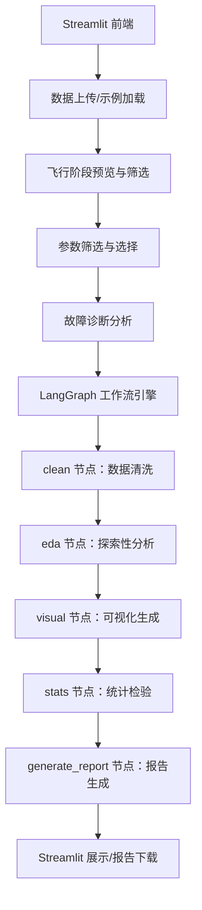

# QAR数据分析自动化工具

## 一、程序概述

本程序是一款基于 **LangGraph 工作流引擎** + **通义千问 Qwen2.5-7B-Instruct 大模型** + **Streamlit 可视化界面** 构建的**QAR（Quick Access Recorder）数据分析工具**。程序专为航空数据分析设计，支持处理大规模QAR数据文件（CSV/BIN格式），具备智能参数筛选、飞行阶段过滤、故障诊断等专业功能，可自动生成结构化的Markdown分析报告。

### 核心特色
- **QAR专业支持**：针对航空QAR数据特点优化，支持大文件分块处理
- **智能参数筛选**：双重筛选机制（参数+飞行阶段），有效处理高维度数据
- **故障诊断**：基于LOCAL/SEL参数对差异分析，自动检测传感器异常
- **Token优化**：实时估算和验证token数量，避免超限问题
- **全流程自动化**：从数据清洗到报告生成无需人工干预

## 二、核心功能

| 功能模块 | 详细说明 |
|----------|----------|
| **多源数据接入** | 支持QAR CSV/BIN格式文件上传，兼容大文件（>300MB自动分块处理） |
| **智能参数筛选** | 支持手动选择或预设模板（发动机监控/飞行性能/系统状态） |
| **飞行阶段筛选** | 自动识别飞行阶段（起飞/巡航/进近等），支持自定义阶段映射 |
| **自动化数据清洗** | 缺失值处理、异常值检测、重复值去除、行业阈值过滤 |
| **探索性数据分析** | 描述性统计、时间序列滑动窗口分析、飞行阶段分组统计 |
| **故障诊断** | LOCAL/SEL参数对差异分析，识别传感器校准问题 |
| **可视化生成** | 参数分布图、相关性热力图、时间序列趋势、飞行阶段箱线图 |
| **统计检验** | Pearson相关性、ANOVA飞行阶段差异检验、业务逻辑合规性验证 |
| **大模型报告生成** | 基于Qwen2.5生成专业Markdown报告，包含故障诊断重点 |
| **报告下载** | 支持一键下载，可自定义文件名（如学号-姓名-06-Data-Processing.md） |

## 三、技术栈说明

### 1. 核心框架
| 技术组件 | 版本 | 作用 |
|----------|------|------|
| LangGraph | 0.1.14 | 构建数据分析工作流，实现节点化任务调度 |
| LangChain | 0.1.17 | 大模型提示词模板管理、LLM调用封装 |
| LangChain-OpenAI | 0.1.7 | 兼容OpenAI API格式，对接硅基流动Qwen2.5-7B-Instruct |
| Streamlit | 1.32.2 | 可视化交互界面，支持数据预览、结果展示、报告下载 |

### 2. 数据处理
| 技术组件 | 版本 | 作用 |
|----------|------|------|
| Pandas | 2.1.4 | 核心数据结构、数据清洗、EDA计算、内存优化 |
| NumPy | 1.26.4 | 数值计算、数组处理、异常值检测 |
| SciPy | 1.11.4 | 统计检验（相关性分析、显著性检验） |
| StatsModels | 0.14.0 | ANOVA分析、回归模型 |

### 3. 可视化
| 技术组件 | 版本 | 作用 |
|----------|------|------|
| Matplotlib | 3.8.2 | 基础绘图引擎，生成直方图、热力图、时间序列图 |
| Seaborn | 0.12.2 | 美化图表，简化分类变量/相关性可视化 |

### 4. 大模型对接
| 技术组件 | 作用 |
|----------|------|
| 硅基流动 Qwen2.5-7B-Instruct | 中文友好的开源大模型，负责将数据分析结果转化为结构化自然语言报告 |
| python-dotenv | 环境变量管理，安全存储大模型 API Key |

## 四、程序架构

### 1. 整体流程


### 2. 核心模块说明
- **工具类（tools.py）**：封装数据清洗、EDA、统计检验、可视化的核心逻辑，包含QAR专用的字段映射、参数筛选、故障诊断等功能
- **工作流（agent.py）**：基于LangGraph定义5个核心节点，通过状态字典管理全流程数据，支持故障诊断结果传递
- **前端（app.py）**：Streamlit实现交互界面，包含参数配置、双重筛选、故障诊断展示、报告生成等完整流程
- **环境配置（.env）**：存储硅基流动API Key，避免硬编码泄露

## 五、使用步骤

### 1. 环境准备
- 安装 Python 3.8+ 环境
- 新建虚拟环境并激活：
  ```bash
  # 创建虚拟环境
  python -m venv venv
  # Windows 激活
  venv\Scripts\activate.bat
  # Mac/Linux 激活
  source venv/bin/activate
  ```

### 2. 依赖安装
将以下内容保存为 `requirements.txt`，执行安装命令：
```txt
# 核心框架
langchain==0.1.17
langchain-core==0.1.22
langchain-openai==0.1.7
langgraph==0.1.14
# 数据处理
pandas==2.1.4
numpy==1.26.4
statsmodels==0.14.0
scipy==1.11.4
# 可视化
matplotlib==3.8.2
seaborn==0.12.2
# 部署与工具
streamlit==1.32.2
python-dotenv==1.0.1
markdown2==2.4.12
# 大模型对接
openai==1.13.3
```
安装命令：
```bash
pip install -r requirements.txt -i https://mirrors.aliyun.com/pypi/simple/
```

### 3. 配置大模型 API Key
在项目根目录新建 `.env` 文件，添加硅基流动 API Key：
```env
SILICONFLOW_API_KEY=你的硅基流动API密钥
```

### 4. 启动程序
```bash
streamlit run submissions/app.py
```
启动后浏览器自动打开 `http://localhost:8501`，或手动访问该地址。

### 5. 程序使用流程

#### 第一步：数据上传与配置
1. **选择数据来源**：
   - 点击「使用示例QAR数据」加载内置测试数据
   - 或上传自定义CSV/BIN格式QAR文件

2. **字段映射配置**（可选）：
   - 如果程序无法识别QAR字段名，可在侧边栏配置自定义映射
   - 支持时间戳、飞行阶段、发动机参数（N1/N2/EGT）、飞行参数（马赫数/高度/温度）等字段映射

3. **大文件处理配置**：
   - 分块大小：10,000-100,000行/块（默认50,000）
   - 文件大小限制：100-1,000MB（默认300MB）

#### 第二步：飞行阶段预览与筛选
1. 程序自动加载数据并识别QAR核心字段
2. 显示飞行阶段分布预览（各阶段数据量和占比）
3. **选择要保留的飞行阶段**：
   - 支持多选（如：起飞、巡航、进近）
   - 未选择的阶段将被过滤，显著减少数据量

#### 第三步：参数筛选与选择
1. **筛选模式选择**：
   - **手动选择**：自定义选择参数
   - **保留全部**：不进行筛选

2. **预设参数模板**（推荐）：
   - **发动机监控**：N1/N2转速、EGT、燃油流量、推力
   - **飞行性能**：高度、速度、马赫数、姿态角、垂直速度
   - **系统状态**：液压压力、电气参数、系统开关

3. **手动参数调整**：
   - 搜索功能：输入关键词快速查找参数
   - 参数分类：核心参数、发动机参数、飞行参数、系统参数等
   - 批量操作：全选/清空/选择默认参数
   - 交互式表格：通过复选框选择参数

#### 第四步：故障诊断分析
1. **自动检测LOCAL/SEL参数对**：
   - 识别成对的传感器参数（如：LOCAL_N1_L vs SEL_N1_L）
   - 计算差异率：|LOCAL - SEL| / SEL

2. **故障判定规则**：
   - 差异率 > 30% 视为异常
   - 故障率 > 10% 视为严重故障
   - 显示故障参数对、故障率、最大差异率

3. **结果展示**：
   - 严重故障用红色标记，可疑异常用黄色标记
   - 提供详细的故障数据和检查建议

#### 第五步：生成完整分析报告
1. **数据准备就绪检查**：
   - 显示最终数据规模（行×列）
   - 显示故障诊断结果（如有）

2. **点击「开始生成完整分析报告」**：
   - 自动执行LangGraph工作流
   - 生成结构化Markdown报告
   - 生成可视化图表

3. **查看与下载**：
   - 在页面查看完整报告内容
   - 点击「下载Markdown报告」按钮
   - 文件名建议：`学号-姓名-06-Data-Processing.md`

## 六、功能亮点

### 1. QAR专业优化
- **大文件处理**：支持300MB+文件，自动分块读取，内存优化
- **字段智能映射**：自动识别QAR缩写字段，映射到标准格式
- **飞行阶段筛选**：基于民航标准阶段定义，显著减少数据量

### 2. 双重筛选机制
- **参数筛选**：按参数类型和重要性筛选，减少列数
- **飞行阶段筛选**：按飞行阶段筛选，减少行数
- **Token验证**：实时估算token数量，确保不超限

### 3. 故障诊断能力
- **LOCAL/SEL参数对分析**：专业检测传感器校准问题
- **差异率计算**：基于行业标准阈值（30%）
- **故障分级**：区分严重故障和可疑异常

### 4. 中文友好
- 基于Qwen2.5-7B-Instruct，生成符合中文表达习惯的报告
- 专业术语准确，洞见易懂

### 5. 可扩展性强
- 支持自定义字段映射
- 可新增数据分析节点
- 可替换其他大模型

## 七、注意事项

### 1. API Key 配置
- 需确保 `.env` 文件中硅基流动 API Key 有效
- 新用户可免费获取额度，足够完成日常分析

### 2. 数据格式要求
- **CSV格式**：建议包含表头，编码推荐 UTF-8
- **BIN格式**：需符合民航QAR二进制规范（头部8字节时间戳+参数块）
- **数据质量**：建议数据量 > 100行，参数数 > 5个

### 3. 性能说明
- **大文件处理**：300MB文件约需1-2分钟加载
- **分析速度**：本地CPU运行时，完整分析约需10-30秒
- **内存占用**：分块处理可将内存占用控制在2GB以内

### 4. 版本兼容性
- 程序已锁定所有依赖版本，请勿随意升级 LangGraph/LangChain
- Python版本要求：3.8-3.11（推荐3.9）

### 5. 虚拟环境
- 启动程序前需确保虚拟环境已激活
- 避免依赖冲突，确保程序正常运行

### 6. 故障诊断限制
- 仅检测LOCAL/SEL参数对差异
- 需要数据中包含LOCAL_和SEL_前缀的参数
- 差异率阈值可调整（默认30%）

## 八、文件结构

```
Data-Processing-sz2507093-/
├── README.md                 # 项目说明文档
├── version2.0.md            # 2.0版本更新说明
├── version3.0.md            # 3.0版本更新说明（修复bug，新增参数筛选功能）
├── submissions/
│   ├── app.py               # Streamlit前端界面
│   ├── agent.py             # LangGraph工作流引擎
│   ├── tools.py             # 数据处理工具类
│   ├── requirements.txt     # 依赖列表
│   ├── .env.example         # 环境变量示例
│   ├── sz2507093-周光正-06-Data-Processing.md  # 示例报告
│   └── visuals/             # 生成的可视化图表目录
│       ├── numeric_dist.png
│       ├── cat_count.png
│       ├── corr_heatmap.png
│       ├── qar_time_series.png
│       ├── qar_phase_boxplot.png
│       └── qar_engine_corr.png
```

## 九、版本更新记录

### Version 3.0（当前版本）
- ✅ 修复version2.0的bug
- ✅ 新增参数筛选功能（自动/手动）
- ✅ 新增飞行阶段筛选功能
- ✅ 新增故障诊断功能（LOCAL/SEL参数对分析）
- ✅ 新增Token验证机制
- ✅ 优化大文件处理（分块读取）
- ✅ 优化字段映射配置

### Version 2.0
- 基础QAR数据分析功能
- 支持CSV/BIN格式
- 基础可视化和报告生成

## 十、技术支持与反馈

如有问题或建议，请通过以下方式联系：
- 项目仓库：https://github.com/zgz-zhougz/Data-Processing-sz2507093-
- 学号：sz2507093
- 姓名：周光正

---

**© 2025 AI数据分析代理 | 基于LangGraph + OpenAI构建**
