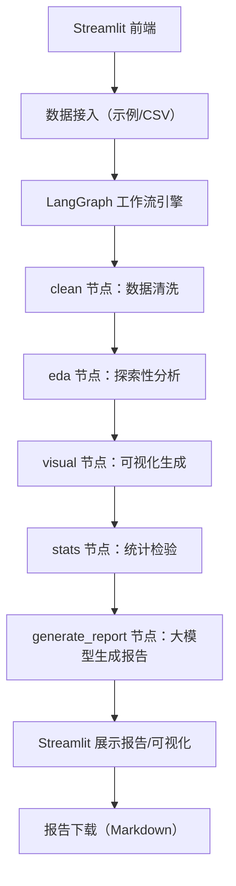

# AI 自动化数据分析报告生成程序
## 一、程序概述
本程序是一款基于 **LangGraph 工作流引擎** + **通义千问 Qwen2.5-7B-Instruct 大模型** + **Streamlit 可视化界面** 构建的自动化数据分析工具。程序支持本地 CSV 数据上传或内置泰坦尼克示例数据，可自动完成数据清洗、探索性分析（EDA）、统计检验、可视化生成，并通过大模型生成结构化、专业化的 Markdown 格式分析报告，全程无需人工干预，适用于快速完成数据分析作业、业务数据洞察等场景。

## 二、核心功能
| 功能模块               | 详细说明                                                                 |
|------------------------|--------------------------------------------------------------------------|
| 多源数据接入           | 支持「泰坦尼克示例数据」一键加载，或自定义上传 CSV 格式数据集（兼容常见结构化数据）； |
| 自动化数据清洗         | 封装缺失值处理、格式标准化、异常值检测等核心清洗逻辑，输出清洗日志和清洗后数据集； |
| 探索性数据分析（EDA）  | 自动计算数据描述性统计（均值、中位数、标准差等）、变量分布特征、类别变量占比；|
| 统计检验               | 自动识别目标列（Survived/Target/Label），完成相关性分析、显著性检验等统计分析；|
| 可视化生成             | 自动生成数值变量分布直方图、分类变量占比图、特征相关性热力图；|
| 大模型驱动报告生成     | 基于 Qwen2.5-7B-Instruct 生成结构化 Markdown 报告，包含数据概述、EDA 结果、统计检验、核心洞见、建议； |
| 报告下载               | 支持生成的分析报告一键下载为 Markdown 文件，符合作业/文档命名规范；|

## 三、技术栈说明
### 1. 核心框架
| 技术组件          | 版本       | 作用                                                                 |
|-------------------|------------|----------------------------------------------------------------------|
| LangGraph         | 0.1.14     | 构建数据分析全流程工作流，实现节点化任务调度（清洗→EDA→可视化→统计→报告）； |
| LangChain         | 0.1.17     | 大模型提示词模板管理、LLM 调用封装；|
| LangChain-OpenAI  | 0.1.7      | 兼容 OpenAI API 格式，对接硅基流动 Qwen2.5-7B-Instruct 模型；|
| Streamlit         | 1.32.2     | 可视化交互界面开发，支持数据预览、结果展示、报告下载；|

### 2. 数据处理
| 技术组件          | 版本       | 作用                                                                 |
|-------------------|------------|----------------------------------------------------------------------|
| Pandas            | 2.1.4      | 核心数据结构（DataFrame）、数据清洗、EDA 计算；|
| NumPy             | 1.26.4     | 数值计算、数组处理；|
| SciPy             | 1.11.4     | 统计检验（相关性分析、显著性检验）；|
| StatsModels       | 0.14.0     | 拓展统计分析能力；|

### 3. 可视化
| 技术组件          | 版本       | 作用                                                                 |
|-------------------|------------|----------------------------------------------------------------------|
| Matplotlib        | 3.8.2      | 基础绘图引擎，生成直方图、热力图等；|
| Seaborn           | 0.12.2     | 美化可视化图表，简化分类变量/相关性可视化；|

### 4. 大模型对接
| 技术组件          | 作用                                                                 |
|-------------------|----------------------------------------------------------------------|
| 硅基流动 Qwen2.5-7B-Instruct | 中文友好的开源大模型，负责将数据分析结果转化为结构化自然语言报告；|
| python-dotenv     | 环境变量管理，安全存储大模型 API Key；|

## 四、程序架构
### 1. 整体流程


### 2. 核心模块说明
- **工具类（tools.py）**：封装数据清洗、EDA、统计检验、可视化的核心逻辑，作为 LangGraph 节点的底层依赖；
- **工作流（agent.py）**：基于 LangGraph 定义 5 个核心节点，通过状态字典（TypedDict）管理全流程数据，节点间按顺序执行并传递状态；
- **前端（app.py）**：Streamlit 实现交互界面，负责数据上传/示例加载、调用工作流、展示结果、提供报告下载；
- **环境配置（.env）**：存储硅基流动 API Key，避免硬编码泄露。

## 五、使用步骤
### 1. 环境准备
- 安装 Python 3.8+ 环境；
- 新建虚拟环境并激活：
  ```bash
  # 创建虚拟环境
  python -m venv venv
  # Windows 激活
  venv\Scripts\activate.bat
  # Mac/Linux 激活
  source venv/bin/activate
  ```

### 2. 依赖安装
将以下内容保存为 `requirements.txt`，执行安装命令：
```txt
# 核心框架
langchain==0.1.17
langchain-core==0.1.22
langchain-openai==0.1.7
langgraph==0.1.14
# 数据处理
pandas==2.1.4
numpy==1.26.4
statsmodels==0.14.0
scipy==1.11.4
# 可视化
matplotlib==3.8.2
seaborn==0.12.2
# 部署与工具
streamlit==1.32.2
python-dotenv==1.0.1
markdown2==2.4.12
# 大模型对接
openai==1.13.3
```
安装命令：
```bash
pip install -r requirements.txt -i https://mirrors.aliyun.com/pypi/simple/
```

### 3. 配置大模型 API Key
在项目根目录新建 `.env` 文件，添加硅基流动 API Key：
```env
SILICONFLOW_API_KEY=你的硅基流动API密钥
```

### 4. 启动程序
```bash
streamlit run app.py
```
启动后浏览器自动打开 `http://localhost:8501`，或手动访问该地址。

### 5. 程序使用流程
1. 选择数据来源：点击「使用泰坦尼克示例数据」，或上传自定义 CSV 文件；
2. 自动执行分析：程序自动触发数据清洗→EDA→可视化→统计检验→报告生成；
3. 查看结果：页面展示原始数据预览、可视化图表、结构化分析报告；
4. 下载报告：点击「下载Markdown报告」，将报告重命名为「学号-姓名-06-Data-Processing.md」保存。

## 六、功能亮点
1. **全流程自动化**：从数据接入到报告生成无需人工干预，降低数据分析门槛；
2. **中文友好**：基于 Qwen2.5-7B-Instruct 大模型，生成的报告符合中文表达习惯，洞见专业且易懂；
3. **环境隔离**：基于虚拟环境部署，避免依赖冲突，适配 Windows/Mac/Linux 系统；
4. **可扩展性强**：支持新增数据分析节点（如特征工程、模型训练），或替换为其他大模型（如 OpenAI GPT-3.5/4、通义千问阿里云版）；
5. **结果标准化**：生成的报告包含「数据概述、EDA、统计检验、核心洞见、建议」5 个核心模块，格式统一且可直接复用。

## 七、注意事项
1. **API Key 配置**：需确保 `.env` 文件中硅基流动 API Key 有效，新用户可免费获取额度，足够完成日常分析；
2. **数据格式要求**：自定义上传的 CSV 文件需为结构化数据，建议包含表头，避免乱码（编码推荐 UTF-8）；
3. **版本兼容**：程序已锁定所有依赖版本，请勿随意升级 LangGraph/LangChain，避免兼容性问题；
4. **虚拟环境使用**：启动程序前需确保虚拟环境已激活，否则可能出现依赖缺失报错；
5. **性能说明**：本地 CPU 运行时，大模型生成报告约需 10-20 秒，耐心等待即可。